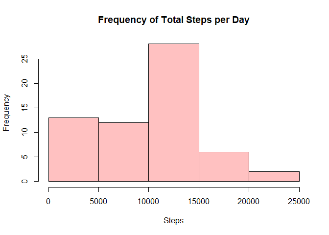
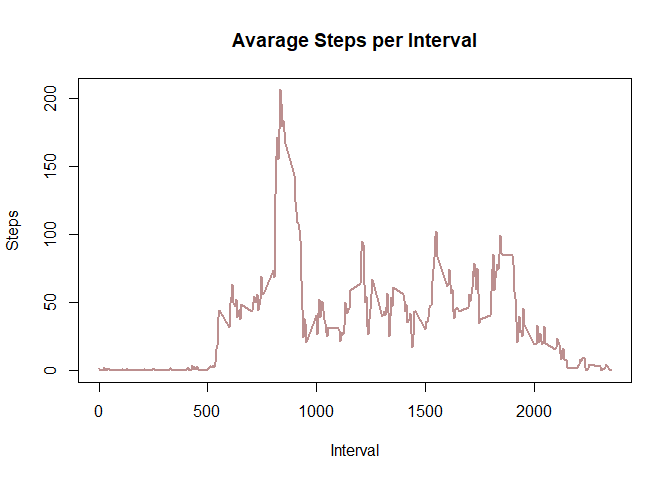
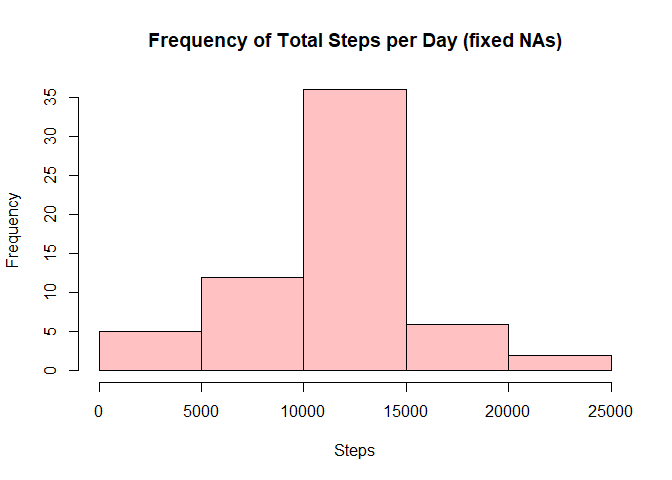
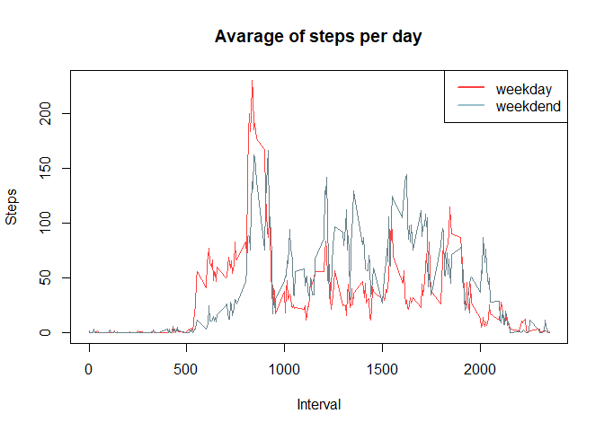

## Loading and preprocessing the data

1. Load the data


```r
library(dplyr)
unzip("activity.zip")
file <- read.csv("activity.csv")
file2 <- read.csv("activity.csv")
```

2. Process/transform the data (if necessary) into a format suitable for your analysis


```r
file$date <- as.Date(file2$date, "%Y-%m-%d")
file2$date <- as.Date(file$date, "%Y-%m-%d")
head(file)
```

```
##   steps       date interval
## 1    NA 2012-10-01        0
## 2    NA 2012-10-01        5
## 3    NA 2012-10-01       10
## 4    NA 2012-10-01       15
## 5    NA 2012-10-01       20
## 6    NA 2012-10-01       25
```


## What is mean total number of steps taken per day?

1. Calculate the total number of steps taken per day


```r
steps_date <- file %>% group_by(date) %>% summarise("steps" = sum(steps, na.rm = TRUE))
print(steps_date)
```

```
## # A tibble: 61 x 2
##    date       steps
##    <date>     <int>
##  1 2012-10-01     0
##  2 2012-10-02   126
##  3 2012-10-03 11352
##  4 2012-10-04 12116
##  5 2012-10-05 13294
##  6 2012-10-06 15420
##  7 2012-10-07 11015
##  8 2012-10-08     0
##  9 2012-10-09 12811
## 10 2012-10-10  9900
## # ... with 51 more rows
```


2. Make a histogram of the total number of steps taken each day


```r
hist(steps_date$steps, xlab = "Steps", main = "Frequency of Total Steps per Day", col = "rosybrown1")
```

<!-- -->

3. Calculate and report the mean and median of the total number of steps taken per day


```r
report <- data.frame("mean" = mean(steps_date$steps, na.rm = TRUE),  "median" = median(steps_date$steps, na.rm = TRUE))
print(report)
```

```
##      mean median
## 1 9354.23  10395
```


## What is the average daily activity pattern?

1. Make a time series plot of the 5-minute interval (x-axis) and the average number of steps taken, averaged across all days (y-axis)


```r
steps_interval <- file %>% group_by(interval) %>% summarise("steps" = mean(steps, na.rm = TRUE))
print(steps_interval)
```

```
## # A tibble: 288 x 2
##    interval  steps
##       <int>  <dbl>
##  1        0 1.72  
##  2        5 0.340 
##  3       10 0.132 
##  4       15 0.151 
##  5       20 0.0755
##  6       25 2.09  
##  7       30 0.528 
##  8       35 0.868 
##  9       40 0     
## 10       45 1.47  
## # ... with 278 more rows
```


```r
plot(steps_interval$interval, steps_interval$steps, type = "l", ylab = "Steps", xlab = "Interval", main = "Avarage Steps per Interval", col = "rosybrown", lwd = 2)
```

<!-- -->

2. Which 5-minute interval, on average across all the days in the dataset, contains the maximum number of steps?


```r
max_interval <- steps_interval[steps_interval$steps == max(steps_interval$steps),]
print(max_interval)
```

```
## # A tibble: 1 x 2
##   interval steps
##      <int> <dbl>
## 1      835  206.
```


## Imputing missing values

1. Calculate and report the total number of missing values in the dataset (i.e. the total number of rows with NAs)


```r
data_na <- sum(is.na(file))
print(data_na)
```

```
## [1] 2304
```

2. Devise a strategy for filling in all of the missing values in the dataset + 3. Create a new dataset that is equal to the original dataset but with the missing data filled in.


```r
cases <- unique(file2$interval)
for (i in cases) { file2[(is.na(file) & file2$interval == i)] = steps_interval[(steps_interval$interval == i),2]}
head(file2)
```

```
##       steps       date interval
## 1  1.716981 2012-10-01        0
## 2 0.3396226 2012-10-01        5
## 3 0.1320755 2012-10-01       10
## 4 0.1509434 2012-10-01       15
## 5 0.0754717 2012-10-01       20
## 6   2.09434 2012-10-01       25
```

4. Make a histogram of the total number of steps taken each day and Calculate and report the mean and median total number of steps taken per day.


```r
steps_date2 <- file2 %>% group_by(date) %>% summarise("steps" = sum(as.numeric(steps)))
print(steps_date2)
```

```
## # A tibble: 61 x 2
##    date        steps
##    <date>      <dbl>
##  1 2012-10-01 10766.
##  2 2012-10-02   126 
##  3 2012-10-03 11352 
##  4 2012-10-04 12116 
##  5 2012-10-05 13294 
##  6 2012-10-06 15420 
##  7 2012-10-07 11015 
##  8 2012-10-08 10766.
##  9 2012-10-09 12811 
## 10 2012-10-10  9900 
## # ... with 51 more rows
```


```r
hist(steps_date2$steps, xlab = "Steps", main = "Frequency of Total Steps per Day (fixed NAs)", col = "rosybrown1")
```

<!-- -->


```r
report2 <- data.frame("NA" = c("corrected", "not corrected"),"mean" = c(mean(steps_date2$steps), mean(steps_date$steps, na.rm = TRUE)), "median" = c(median(steps_date2$steps), median(steps_date$steps, na.rm = TRUE)))
print(report2)
```

```
##             NA.     mean   median
## 1     corrected 10766.19 10766.19
## 2 not corrected  9354.23 10395.00
```


## Are there differences in activity patterns between weekdays and weekends?

1. Create a new factor variable in the dataset with two levels – “weekday” and “weekend” indicating whether a given date is a weekday or weekend day.


```r
file2$day <- weekdays(file2$date, abbreviate = TRUE)
#abbreviations are in portuguese because of my configurations
file2$day[file2$day == "seg" | file2$day == "ter" | file2$day == "qua" | file2$day == "qui" | file2$day == "sex"] = "weekday"
file2$day[file2$day == "sáb" | file2$day == "dom"] = "weekend"
head(file2)
```

```
##       steps       date interval     day
## 1  1.716981 2012-10-01        0 weekday
## 2 0.3396226 2012-10-01        5 weekday
## 3 0.1320755 2012-10-01       10 weekday
## 4 0.1509434 2012-10-01       15 weekday
## 5 0.0754717 2012-10-01       20 weekday
## 6   2.09434 2012-10-01       25 weekday
```


2. Make a panel plot containing a time series plot (i.e. \color{red}{\verb|type = "l"|}type = "l") of the 5-minute interval (x-axis) and the average number of steps taken, averaged across all weekday days or weekend days (y-axis).


```r
steps_day <- file2 %>% group_by(day, interval) %>% summarise("steps" = mean(as.numeric(steps)))
head(steps_day)
```

```
## # A tibble: 6 x 3
## # Groups:   day [1]
##   day     interval  steps
##   <chr>      <int>  <dbl>
## 1 weekday        0 2.25  
## 2 weekday        5 0.445 
## 3 weekday       10 0.173 
## 4 weekday       15 0.198 
## 5 weekday       20 0.0990
## 6 weekday       25 1.59
```


```r
with(subset(steps_day, day == "weekday"), plot(interval, steps, type = "l", col = "brown1", main = "Avarage of steps per day", xlab = "Interval", ylab = "Steps"))
with(subset(steps_day, day == "weekend"), points(interval, steps, type = "l", col = "lightblue 4"))
legend("topright", legend = c("weekday", "weekdend"), col = c("brown1","lightblue3"), lwd= 2)
```

<!-- -->

